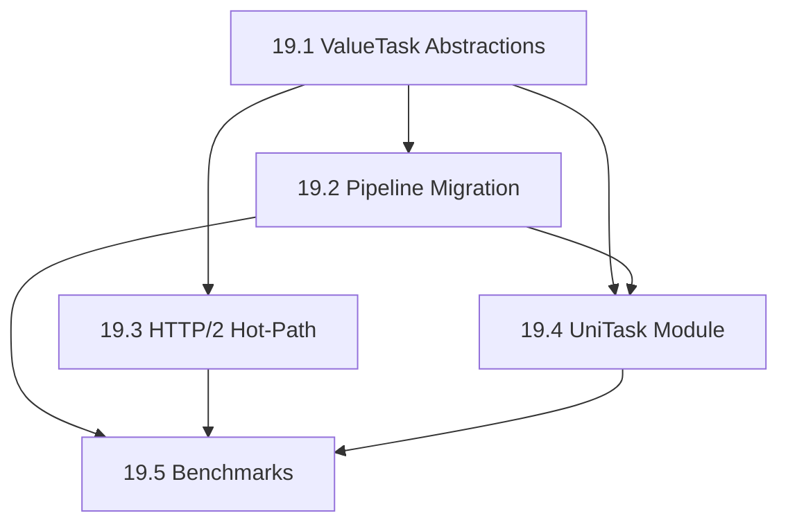

# Phase 19 Plan Review — 2026-02-21

**Scope:** Phase 19: Async Runtime Refactor with Optional UniTask Adapters (Tasks 19.1–19.5)

**Reviewed by:** unity-infrastructure-architect + unity-network-architect (combined)

---

## Files Referenced

| File | Lines | Role |
|------|------:|------|
| [HttpPipeline.cs](file:///Users/arturkoshtei/workspace/turboHTTP/Runtime/Core/Pipeline/HttpPipeline.cs) | 64 | Middleware dispatch chain (Task-based) |
| [IHttpMiddleware.cs](file:///Users/arturkoshtei/workspace/turboHTTP/Runtime/Core/IHttpMiddleware.cs) | 23 | Middleware interface + `HttpPipelineDelegate` |
| [IHttpTransport.cs](file:///Users/arturkoshtei/workspace/turboHTTP/Runtime/Core/IHttpTransport.cs) | 28 | Transport abstraction |
| [IHttpInterceptor.cs](file:///Users/arturkoshtei/workspace/turboHTTP/Runtime/Core/IHttpInterceptor.cs) | 116 | Request/response interceptor (already `ValueTask`) |
| [IHttpPlugin.cs](file:///Users/arturkoshtei/workspace/turboHTTP/Runtime/Core/IHttpPlugin.cs) | 79 | Plugin lifecycle (already `ValueTask`) |
| [AdaptiveMiddleware.cs](file:///Users/arturkoshtei/workspace/turboHTTP/Runtime/Core/AdaptiveMiddleware.cs) | — | Bridges plugin/interceptor (`ValueTask`) → pipeline (`Task`) |
| [RawSocketTransport.cs](file:///Users/arturkoshtei/workspace/turboHTTP/Runtime/Transport/RawSocketTransport.cs) | 775 | HTTP/1.1 + routing transport |
| [Http2Stream.cs](file:///Users/arturkoshtei/workspace/turboHTTP/Runtime/Transport/Http2/Http2Stream.cs) | 224 | Per-stream state with `TaskCompletionSource` |
| [Http2Connection.cs](file:///Users/arturkoshtei/workspace/turboHTTP/Runtime/Transport/Http2/Http2Connection.cs) | — | Connection lifecycle + settings TCS |
| [Http2ConnectionManager.cs](file:///Users/arturkoshtei/workspace/turboHTTP/Runtime/Transport/Http2/Http2ConnectionManager.cs) | 154 | Per-host connection cache (Task-based) |
| [TcpConnectionPool.cs](file:///Users/arturkoshtei/workspace/turboHTTP/Runtime/Transport/Tcp/TcpConnectionPool.cs) | 651 | Connection pooling (Task-based) |
| [HappyEyeballsConnector.cs](file:///Users/arturkoshtei/workspace/turboHTTP/Runtime/Transport/Connection/HappyEyeballsConnector.cs) | 393 | Dual-stack racing with `TaskCompletionSource` |
| [UHttpClient.cs](file:///Users/arturkoshtei/workspace/turboHTTP/Runtime/Core/UHttpClient.cs) | — | Public API (`Task<UHttpResponse> SendAsync`) |
| 15 middleware implementations | — | `Auth/`, `Cache/`, `Middleware/`, `Observability/`, `Performance/`, `Retry/` |

---

## Findings

### ~~Critical (R3-C1): Middleware shim strategy underestimates blast radius~~ — RESOLVED

**Agent:** unity-infrastructure-architect

**Status:** ✅ Resolved by project clarification.

**Resolution:** TurboHTTP is a new package with no released public API contract. There is no backward compatibility requirement for the existing `Task`-based interfaces. The entire pipeline — `HttpPipelineDelegate`, `IHttpMiddleware`, `IHttpTransport`, `HttpPipeline`, and `UHttpClient.SendAsync` — can be migrated to `ValueTask<UHttpResponse>` directly without any shim layer or dual-interface period.

This means Task 19.1 should be reframed: instead of "boundary adapters" and "adapter shims," it becomes a **direct migration** of all interfaces and implementations to `ValueTask`-first. The `AdaptiveMiddleware` bridge between `ValueTask` (interceptors/plugins) and `Task` (pipeline) can be eliminated entirely, since both sides will be `ValueTask`.

**Plan update needed:** Remove references to "adapter shims" and "migration guide for custom middleware authors" from Task 19.1. Replace with direct `ValueTask` migration of all interfaces.

---

### ~~Critical (R3-C2): `IValueTaskSource` / `ManualResetValueTaskSourceCore` not mentioned — IL2CPP risk~~ — RESOLVED

**Agent:** unity-infrastructure-architect

**Status:** ✅ Resolved in plan update.

**Resolution:** Task 19.3 now explicitly names `ManualResetValueTaskSourceCore<T>` as the target API, includes an IL2CPP AOT smoke test as a pre-requisite, and specifies a fallback strategy (pooling `TaskCompletionSource<T>` via `ObjectPool<T>`).

---

### ~~Warning (W-1): Task 19.3 scope overlaps with Happy Eyeballs but plan doesn't list it~~ — RESOLVED

**Agent:** unity-network-architect

**Status:** ✅ Resolved in plan update.

**Resolution:** Task 19.3 now includes a scope note explicitly stating that `HappyEyeballsConnector.cs` allocations occur once per connection establishment (not per request) and are low-priority, deferrable to Phase 19a.

---

### ~~Warning (W-2): `Http2ConnectionManager.GetOrCreateAsync` should be mentioned as a ValueTask candidate~~ — RESOLVED

**Agent:** unity-network-architect

**Status:** ✅ Resolved in plan update.

**Resolution:** Task 19.2 now explicitly lists both `Http2ConnectionManager.GetOrCreateAsync` and `TcpConnectionPool.GetConnectionAsync` as priority targets with ROI analysis noting their synchronous fast paths.

---

### ~~Warning (W-3): Effort estimate for Task 19.1 is optimistic given middleware count~~ — RESOLVED

**Agent:** unity-infrastructure-architect

**Status:** ✅ Resolved by project clarification.

**Resolution:** With no backward compatibility constraint, Task 19.1 is a direct search-and-replace of `Task<UHttpResponse>` → `ValueTask<UHttpResponse>` across all interfaces and implementations. No shim layer needed. 1 week effort is feasible and may even be slightly generous.

---

### ~~Warning (W-4): Missing dependency — `IHttpInterceptor` and `IHttpPlugin` already use `ValueTask`~~ — RESOLVED

**Agent:** unity-infrastructure-architect

**Status:** ✅ Resolved by project clarification.

**Resolution:** With the full `ValueTask` migration, `IHttpInterceptor` and `IHttpPlugin` are already aligned. The `AdaptiveMiddleware` `ValueTask` → `Task` bridge code can be **removed** rather than adapted, since the pipeline will natively consume `ValueTask`. This is a simplification, not a new concern.

---

### ~~Warning (W-5): UniTask `PlayerLoopTiming` integration needs specificity~~ — RESOLVED

**Agent:** unity-infrastructure-architect

**Status:** ✅ Resolved in plan update.

**Resolution:** Task 19.4 now specifies `PlayerLoopTiming.Update` as the default, configurable via `TurboHttpUniTaskOptions.DefaultPlayerLoopTiming`, and documents that the existing request `CancellationToken` must be passed through to UniTask continuations.

---

### Info (I-1): Phase 19 / 19a scope boundary is well-defined

**Agent:** unity-network-architect + unity-infrastructure-architect

Verified that Phase 19 and Phase 19a have clean scope separation:

| Concern | Phase 19 | Phase 19a |
|---------|----------|-----------|
| Async scheduling overhead | ✅ ValueTask migration | — |
| TaskCompletionSource pooling | ✅ IValueTaskSource | — |
| Buffer allocation | — | ✅ ArrayPool sweep |
| Object pooling (UHttpResponse, etc.) | — | ✅ ObjectPool<T> |
| TLS provider strategy | — | ✅ System TLS priority |
| SAEA zero-alloc sockets | — | ✅ Opt-in transport |

Phase 19a explicitly depends on Phase 19, and Phase 19 correctly notes the boundary: "For absolute zero-allocation strategies including buffer pooling... see Phase 19a."

✅ No scope overlap issues.

---

### Info (I-2): Prioritization matrix task dependencies are correct

**Agent:** unity-network-architect

Verified the dependency graph:

The plan correctly notes that Tasks 19.2 and 19.3 can proceed in parallel after 19.1.

✅ Dependency order is sound.

---

### Info (I-3): `versionDefines` strategy for UniTask is correct

**Agent:** unity-infrastructure-architect

The plan correctly specifies `versionDefines` in the `.asmdef` to conditionally compile the UniTask module only when `com.cysharp.unitask` is present. This matches the pattern already established by the project (WebSocket transport uses `[ModuleInitializer]` delegate registration, not compile-time `#if` defines).

✅ Matches existing project patterns.

---

### ~~Info (I-4): Verification plan covers essential areas but could be stronger~~ — RESOLVED

**Agent:** unity-network-architect

**Status:** ✅ Resolved in plan update.

**Resolution:** Verification plan now includes step #6: `ValueTask` single-consumption guarantee validated under concurrent middleware + HTTP/2 multiplexed request stress test.

---

## Recommended Fix Order

All findings have been resolved:

1. ~~**R3-C1** — Clarify middleware migration strategy~~ — ✅ Resolved (direct `ValueTask` migration, no shims)
2. ~~**R3-C2** — Name `ManualResetValueTaskSourceCore<T>` explicitly + IL2CPP guard~~ — ✅ Resolved in plan
3. ~~**W-4** — Acknowledge existing `ValueTask` usage in interceptors/plugins~~ — ✅ Resolved
4. ~~**W-2** — List specific `ValueTask` migration targets with ROI analysis~~ — ✅ Resolved in plan
5. ~~**W-3** — Adjust effort estimates per chosen strategy~~ — ✅ Resolved (1 week feasible)
6. ~~**W-1** — Clarify Happy Eyeballs scope placement~~ — ✅ Resolved in plan
7. ~~**W-5** — Specify UniTask `PlayerLoopTiming` defaults~~ — ✅ Resolved in plan
8. ~~**I-4** — Add ValueTask single-consumption stress test to verification~~ — ✅ Resolved in plan

---

## Summary

Phase 19 is a **well-scoped and well-motivated** plan. The async runtime refactor addresses real scheduling overhead in the existing codebase. The scope boundary with Phase 19a is clean. The UniTask adapter approach correctly preserves Core's zero-dependency principle.

**All findings have been resolved** in plan updates:
- Direct `Task` → `ValueTask` migration across all interfaces (no shims, no backward compat)
- `ManualResetValueTaskSourceCore<T>` named explicitly with IL2CPP guard and fallback
- Connection pool fast-path targets listed with ROI analysis
- Happy Eyeballs correctly scoped as low-priority / deferrable
- UniTask `PlayerLoopTiming` defaults and `CancellationToken` threading specified
- ValueTask single-consumption stress test added to verification

The plan is ready for implementation.
