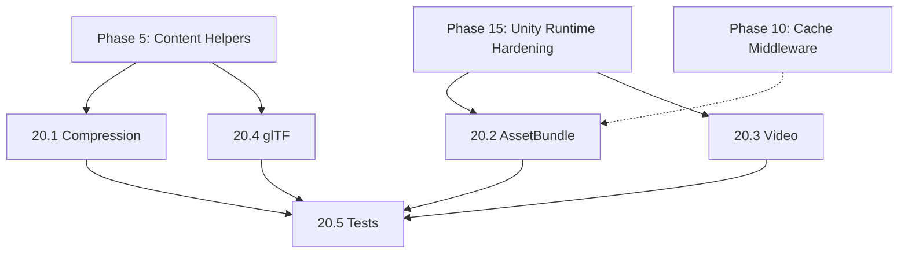

# Phase 20 Plan Review — 2026-02-21

**Scope:** Phase 20: Advanced Content Handlers (Tasks 20.1–20.5)

**Reviewed by:** unity-content-pipeline-architect + unity-platform-compatibility-architect (combined)

---

## Files Referenced

| File | Lines | Role |
|------|------:|------|
| [Texture2DHandler.cs](file:///Users/arturkoshtei/workspace/turboHTTP/Runtime/Unity/Texture2DHandler.cs) | 684 | Existing image handler — establishes handler pattern |
| [AudioClipHandler.cs](file:///Users/arturkoshtei/workspace/turboHTTP/Runtime/Unity/AudioClipHandler.cs) | 513 | Existing audio handler — establishes handler pattern |
| [UHttpResponse.cs](file:///Users/arturkoshtei/workspace/turboHTTP/Runtime/Core/UHttpResponse.cs) | 212 | Response model — `ReadOnlyMemory<byte>` body, `GetContentEncoding()` |
| [IHttpMiddleware.cs](file:///Users/arturkoshtei/workspace/turboHTTP/Runtime/Core/IHttpMiddleware.cs) | 23 | Middleware interface — `ValueTask<UHttpResponse>` pipeline |
| [ContentTypes.cs](file:///Users/arturkoshtei/workspace/turboHTTP/Runtime/Core/ContentTypes.cs) | — | MIME constants (Phase 5.2) |
| [TextureDecodeScheduler.cs](file:///Users/arturkoshtei/workspace/turboHTTP/Runtime/Unity/TextureDecodeScheduler.cs) | — | Phase 15 decode scheduling with memory/concurrency guards |
| [DecoderRegistry.cs](file:///Users/arturkoshtei/workspace/turboHTTP/Runtime/Unity/Decoders/DecoderRegistry.cs) | — | Phase 15 decoder-provider pattern |
| [UnityTempFileManager.cs](file:///Users/arturkoshtei/workspace/turboHTTP/Runtime/Unity/UnityTempFileManager.cs) | — | Phase 15 temp-file lifecycle management |
| [MainThreadDispatcher.cs](file:///Users/arturkoshtei/workspace/turboHTTP/Runtime/Unity/MainThreadDispatcher.cs) | — | Phase 15 main-thread dispatch |
| [CacheMiddleware.cs](file:///Users/arturkoshtei/workspace/turboHTTP/Runtime/Cache/CacheMiddleware.cs) | — | Phase 10 caching middleware |
| [HpackStaticTable.cs](file:///Users/arturkoshtei/workspace/turboHTTP/Runtime/Transport/Http2/HpackStaticTable.cs) | — | HPACK entry 16: `accept-encoding: gzip, deflate` |
| [phase-21-grpc-client.md](file:///Users/arturkoshtei/workspace/turboHTTP/Development/docs/phases/phase-21-grpc-client.md) | 185 | Phase 21 — contains Task 21.1 Protobuf Handler (moved from Phase 20) |

---

## Summary Verdict

| Severity | Count | Status |
|----------|-------|--------|
| 🔴 Critical | 2 | ✅ Resolved |
| 🟡 Warning | 5 | ✅ Resolved |
| 🟢 Info | 4 | Documented |

---

## 🔴 Critical Findings

### ~~C-1: Task 20.1 Compression Is a Middleware, Not a Content Handler — Wrong Architectural Layer~~ — RESOLVED

**Agent:** unity-content-pipeline-architect

The plan describes Task 20.1 as `GzipContentDecoder` / `BrotliContentDecoder` "content decoders" that follow the "existing `IContentHandler` / decoder-provider pattern from Phase 5 / Phase 15." This is architecturally incorrect on two counts:

1. **No `IContentHandler` interface exists.** The codebase uses static extension method classes (`Texture2DHandler`, `AudioClipHandler`) — there is no `IContentHandler` abstraction. Phase 15's decoder-provider pattern (`DecoderRegistry`, `IImageDecoder`, `IAudioDecoder`) is a Unity-specific decode abstraction for asset types, not a general content handler pattern. Referencing an interface that doesn't exist implies the plan assumes infrastructure that must be designed.

2. **Compression operates at the transport/middleware layer, not content layer.** `Content-Encoding: gzip/br` decompression is a transport-level concern that must happen *before* any content handler sees the body. It is not specific to a content type — it applies to JSON, HTML, images, or any response body. The correct architecture is an `IHttpMiddleware` (decompression middleware) that:
   - Injects `Accept-Encoding: gzip, br` into outbound requests
   - Intercepts responses with `Content-Encoding: gzip` or `Content-Encoding: br`
   - Decompresses the body and replaces it in the response before downstream middleware/handlers see it
   - Removes the `Content-Encoding` header after decompression

   This is fundamentally different from Tasks 20.2–20.4, which are genuine content handlers (Unity-specific asset decode/load).

**Impact:** If implemented as a "content handler," decompression would not benefit the general pipeline — callers would need to manually invoke the decoder. As a middleware, it automatically decompresses all responses transparently.

**Status:** ✅ Resolved in plan update.

**Resolution:** Task 20.1 reframed as `DecompressionMiddleware : IHttpMiddleware`. Plan now specifies: registration in `UHttpClientOptions.Middlewares` pipeline, `Accept-Encoding` header injection on outbound requests, streaming decompression with `ReadOnlyMemory<byte>` body replacement, `Content-Encoding` header removal after decompression, and `link.xml` preservation for IL2CPP. Tasks 20.2–20.4 explicitly follow the static handler class pattern.

---

### ~~C-2: Design Principles Reference Non-Existent Abstraction (`IContentHandler`)~~ — RESOLVED

**Agent:** unity-content-pipeline-architect

**Section:** Design Principles (line 15)

> Each handler follows the existing `IContentHandler` / decoder-provider pattern from Phase 5 / Phase 15.

No `IContentHandler` interface exists in the codebase. The existing handler pattern is:

| Component | Pattern | Example |
|-----------|---------|---------|
| Phase 5 content helpers | Static methods on `UHttpResponse` | `GetBodyAsString()`, `GetContentEncoding()` |
| Phase 15 asset handlers | Static extension method classes | `Texture2DHandler.GetTextureAsync()`, `AudioClipHandler.GetAudioClipAsync()` |
| Phase 15 decoder providers | Interface + registry | `IImageDecoder`, `IAudioDecoder`, `DecoderRegistry` |

**Status:** ✅ Resolved in plan update.

**Resolution:** All references to `IContentHandler` removed. Design Principles and Overview now explicitly state: Task 20.1 is an `IHttpMiddleware`, Tasks 20.2–20.4 follow the "static handler class pattern established by `Texture2DHandler` and `AudioClipHandler`."

---

## 🟡 Warning Findings

### ~~W-1: Task 20.1 Brotli Availability Is Understated — WebGL and IL2CPP Impact~~ — RESOLVED

**Agent:** unity-platform-compatibility-architect

The plan notes:
> Brotli requires .NET Standard 2.1 / .NET 5+ — may not be available on all Unity targets

This understates the issue. Specifics:

| Platform | .NET Backend | `BrotliStream` Available |
|----------|-------------|------------------------|
| Editor + Standalone (Mono) | .NET Standard 2.1 | ✅ (Unity 2021.2+) |
| Editor + Standalone (IL2CPP) | .NET Standard 2.1 | ✅ (Unity 2021.2+) |
| iOS (IL2CPP) | .NET Standard 2.1 | ✅ but verify AOT |
| Android (IL2CPP) | .NET Standard 2.1 | ✅ but verify AOT |
| WebGL | .NET Standard 2.0 | ❌ Not available |
| Older Unity (< 2021.2) | .NET Standard 2.0 | ❌ Not available |

Additionally, `System.IO.Compression.BrotliStream` must be preserved in `link.xml` for IL2CPP builds to prevent stripping.

**Status:** ✅ Resolved in plan update.

**Resolution:** Plan now includes full platform compatibility matrix (5 rows), `link.xml` requirement for IL2CPP, and specifies runtime capability probe for Brotli availability.

---

### ~~W-2: Task 20.2 AssetBundle Cache Integration References Phase 10 Without Specifying Interaction~~ — RESOLVED

**Agent:** unity-content-pipeline-architect

The plan mentions "Caching integration with Unity's built-in AssetBundle cache or Phase 10 cache middleware" but does not specify:

1. How `CacheMiddleware` (Phase 10) would participate — `CacheMiddleware` caches `UHttpResponse` objects (headers + body bytes), but `AssetBundle.LoadFromMemoryAsync` consumes the body destructively. Cache integration would need to store the raw response bytes, not the loaded `AssetBundle`.
2. Whether Unity's built-in AssetBundle caching (`Caching.IsVersionCached`, `CRC` checks) is compatible with the TurboHTTP download path — Unity's caching API is designed for `UnityWebRequest`, not custom HTTP clients.
3. Whether the cache key uses the URL, the URL + CRC, or the URL + version hash.

**Status:** ✅ Resolved in plan update.

**Resolution:** Plan now explicitly scopes caching to Phase 10 `CacheMiddleware` (raw bytes, re-decode on cache hit). Unity's built-in `Caching` API documented as incompatible with custom HTTP clients.

---

### ~~W-3: Task 20.2/20.3 Do Not Specify Memory vs Temp-File Threshold~~ — RESOLVED

**Agent:** unity-content-pipeline-architect

`Texture2DHandler` and `AudioClipHandler` both implement explicit memory management strategies:
- `Texture2DHandler` has `MaxBodySizeBytes` guard (default configurable)
- `AudioClipHandler` uses `UnityTempFileManager` with temp-file routing for large clips

Task 20.2 mentions "downloads to memory or temp file" but does not specify:
- What determines memory vs file path (file size threshold? configurable?)
- Whether it uses `UnityTempFileManager` for temp file management (it should, for consistency with Phase 15)
- Maximum download size guard to prevent OOM

Task 20.3 mentions "downloads to a temp file" without specifying `UnityTempFileManager` integration.

**Status:** ✅ Resolved in plan update.

**Resolution:** Task 20.2 now specifies: 16 MB default threshold for memory vs temp-file, 512 MB max download guard, `UnityTempFileManager` integration, deferred temp-file release until `Unload()`. Task 20.3 specifies `UnityTempFileManager` for download mode and 1 GB max download guard.

---

### ~~W-4: Task 20.3 Video Handler Scope Ambiguity — Download vs URL Passthrough~~ — RESOLVED

**Agent:** unity-platform-compatibility-architect

Task 20.3 lists two contradictory deliverables:
1. `VideoContentHandler` — "downloads to a temp file for `VideoPlayer.url` playback"
2. "Streaming support via URL passthrough (let `VideoPlayer` handle its own streaming)"

These are fundamentally different approaches:
- **Download-to-file**: TurboHTTP downloads the entire video, saves to temp file, then `VideoPlayer` loads from local path. This requires full download before playback starts.
- **URL passthrough**: `VideoPlayer.url = remoteUrl` — TurboHTTP doesn't touch the video data at all, just passes the URL. The `VideoPlayer` handles its own networking.

The plan should clarify:
- Is the handler primarily a download helper (like `AudioClipHandler`) or a URL configuration helper?
- If both, how are they differentiated in the API? (e.g., `GetVideoFileAsync` vs `PrepareVideoUrl`)
- What value does TurboHTTP add for the URL passthrough case? (headers? authentication? progress reporting?)

**Status:** ✅ Resolved in plan update.

**Resolution:** Two distinct modes with separate APIs: `VideoHandler.GetVideoFileAsync` (download to temp file) and `VideoHandler.PrepareVideoUrl` (URL passthrough with auth headers). Use-case guidance documented.

---

### ~~W-5: Effort Estimate for Task 20.2 (AssetBundle) Is Optimistic~~ — RESOLVED

**Agent:** unity-content-pipeline-architect

Task 20.2 is estimated at 1-2 weeks but includes:
1. Memory and temp-file download paths
2. CRC/hash integrity verification
3. Caching integration with both Unity's cache and Phase 10
4. `AssetBundle.LoadFromMemoryAsync` / `LoadFromFile` main-thread integration
5. Convenience API `await client.GetAssetBundleAsync(url)`
6. WebGL exclusion handling
7. `MainThreadDispatcher` integration (AssetBundle APIs are main-thread only)

For context, `Texture2DHandler` (684 lines) and `AudioClipHandler` (513 lines) each required significant implementation for similar scope. The AssetBundle handler has additional complexity around:
- Unity's AssetBundle internal reference counting (must call `Unload()`)
- `LoadFromFile` requires the file to exist for the lifetime of the bundle
- CRC validation requires `AssetBundle.LoadFromFileAsync` overload with CRC parameter

**Status:** ✅ Resolved in plan update.

**Resolution:** Task 20.2 effort adjusted to 2-3 weeks. Total phase effort updated to 7-10 weeks.

---

## 🟢 Info Findings

### I-1: Dependency Chain Is Correct but Understated

**Agent:** unity-content-pipeline-architect

Phase 20 declares dependencies: "Phase 5 (Content Handlers), Phase 15 (Decoder Provider Matrix, Pipeline Hardening)." Verified against codebase:

**Note:** Task 20.1 (Compression) should also list Phase 4 (Pipeline Infrastructure / `IHttpMiddleware`) as a dependency, since it implements a middleware, not a standalone handler.

---

### I-2: Protobuf Handler Successfully Moved to Phase 21

**Agent:** unity-content-pipeline-architect

Verified that the Protobuf handler (previously in Phase 20) has been correctly moved to Phase 21 as Task 21.1. The Phase 20 document no longer references Protobuf. Phase 21 Task 21.1 includes `ProtobufContentHandler<T>`, `response.AsProtobuf<MyMessage>()` API, and IL2CPP AOT-safety requirements. ✅

---

### I-3: Prioritization Matrix Is Reasonable

**Agent:** unity-platform-compatibility-architect

The prioritization order (Compression > AssetBundle > Video > glTF) correctly reflects:
1. **Compression** benefits every HTTP response — highest ROI
2. **AssetBundle** is a core Unity use case — high value for game developers
3. **Video** is important but `VideoPlayer` already handles streaming natively
4. **glTF** is optional and requires third-party dependency

The release mapping (v1.2.0 for Compression + AssetBundle, v1.3.0 for Video, v1.4.0 for glTF) aligns with incremental delivery.

---

### I-4: Task 20.4 glTF Bridge Pattern Is Correct

**Agent:** unity-content-pipeline-architect

The plan correctly positions the glTF handler as a bridge, not a parser:
> No built-in glTF parser — provide the bridge, not the parser

This avoids pulling a large third-party dependency into TurboHTTP Core. The handler downloads the file and returns a descriptor for the user's chosen importer (`GLTFUtility`, `UnityGLTF`, etc.).

However, the plan should specify the descriptor shape and how importers register with it. A minimal interface like `IGltfImporter.Import(Stream/byte[], CancellationToken)` would be useful.

---

## Recommended Fix Order

All findings have been resolved:

1. ~~**C-1** — Reframe Task 20.1 as a decompression middleware~~ — ✅ Resolved (reframed as `DecompressionMiddleware : IHttpMiddleware`)
2. ~~**C-2** — Replace `IContentHandler` references with actual pattern name~~ — ✅ Resolved (static handler class pattern)
3. ~~**W-1** — Add Brotli platform matrix and `link.xml` requirement~~ — ✅ Resolved in plan
4. ~~**W-2** — Clarify AssetBundle cache integration scope~~ — ✅ Resolved in plan
5. ~~**W-3** — Add memory/temp-file thresholds and `UnityTempFileManager` integration~~ — ✅ Resolved in plan
6. ~~**W-4** — Clarify video handler download vs passthrough modes~~ — ✅ Resolved in plan
7. ~~**W-5** — Adjust AssetBundle effort estimate~~ — ✅ Resolved (2-3 weeks)

---

## Summary

Phase 20 is a **well-motivated and correctly scoped** set of incremental feature additions. The handler-per-asset-type approach matches the established codebase pattern, and the incremental delivery strategy (each handler ships independently) is sound.

**All findings have been resolved** in plan updates:
- Task 20.1 reframed as `DecompressionMiddleware : IHttpMiddleware` with full platform matrix and `link.xml` requirements
- `IContentHandler` references replaced with actual static handler class pattern
- AssetBundle caching scoped to Phase 10 `CacheMiddleware` (raw bytes); Unity `Caching` API documented as incompatible
- Memory/temp-file thresholds and `UnityTempFileManager` integration specified for Tasks 20.2/20.3
- Video handler split into download (`GetVideoFileAsync`) and passthrough (`PrepareVideoUrl`) modes
- Task 20.2 effort adjusted to 2-3 weeks; total phase effort updated to 7-10 weeks

The plan is ready for implementation.
